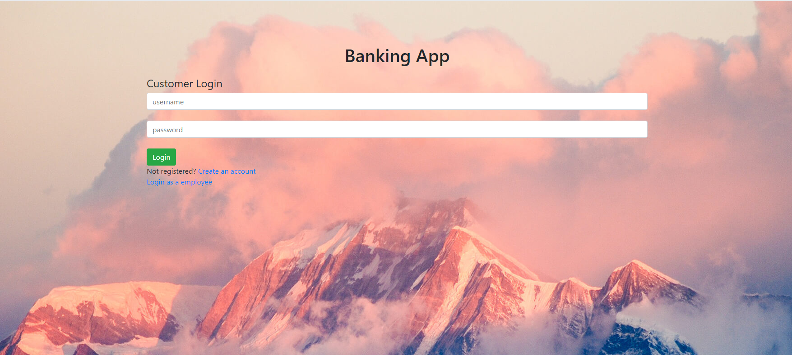

# Banking App

## Project Description
The Bank app is a console-based application that simulates banking operations. A customer can apply for an account, view their balance, and make withdrawals and deposits. An employee can approve or deny accounts and view account balances for their customers.
Here goes your awesome project description!

## Technologies Used

* Languages - JS, Java, HTML, PostgreSQL
* Frameworks - Javalin, Restful, Bootstrap
* Testing - Junit, Mockito
* Others - JDBC, AWS, IntelliJ,Visual studio Code, Log4j

## Features

List of features ready and TODOs for future development
* Login for both customer and employee
* Register for new user accounts 
* Customers can apply for new bank accounts
* Customers can view their own account information including past transactions and  make transactions by deposit, withdraw, tranfer, accept transfers from different users
* Employee can perform search for customers or transactions using filters (customer id, bankaccount id, username, date, transaction id)
* Employee can accept and reject customer accounts

To-do list:
* Improvise UI to be more friendly 
* Add a uploading feature that contain images of the employe or list of customer accounts to get approved
* Only certain employees like supervisors or admins have access to employee registration  

## Getting Started
* git clone https://github.com/Phuc15/Revature_Projects_PhucHuynh.git
* javac BankMain.java
* java BankMain
* google-chrome customerlogin.html

> IDEs: Visual studio Code, Intellij
* run the BankMain.java 
*  run the customerlogin.html

## Usage

* Customer Login

## License

This project uses the following license: [<license_name>](<link>).
